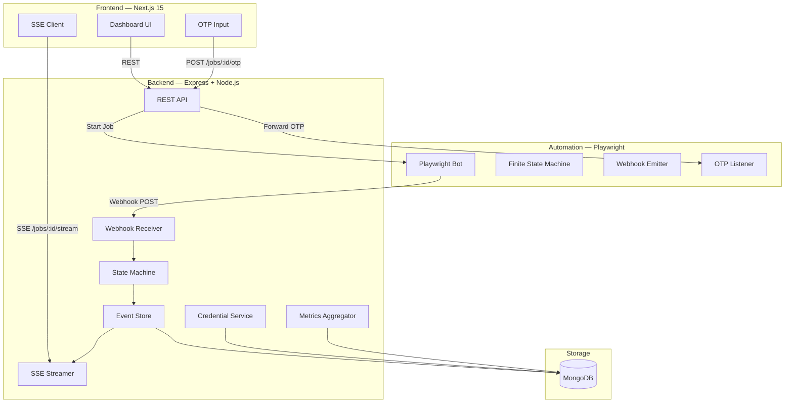

# Income Tax Portal Automation Platform

A production-ready, three-tier automation platform designed to generate taxpayer portal credentials using Playwright headless bots, Express API coordination services, and Next.js live-observe consoles.

Observability is the primary focus of this project, featuring real-time Server-Sent Events (SSE) logs, stepper status trackers, human-in-the-loop CAPTCHA/OTP resolution, and secure AES-256-GCM encryption for credentials storage.

---

## 1. System Architecture



---

## 2. Folder Structure

```
root/
├── shared/               # Shared libraries (NPM workspaces)
│   ├── src/
│   │   ├── constants/    # FSM state order, error levels, phase definitions
│   │   ├── types/        # TypeScript interfaces for Jobs, Metrics, events
│   │   ├── schemas/      # Zod validation rules (PAN regex, OTP schemas)
│   │   ├── interfaces/   # StateMachine, repositories, emitters specifications
│   │   └── utils/        # PAN/Password/OTP masking helpers, UUID generators
│
├── backend/              # Node.js Express API + Event Streaming Coordinator
│   ├── src/
│   │   ├── config/       # MongoDB connections, CORS settings, env checks
│   │   ├── models/       # Mongoose Schemas (jobs, events, credentials, metrics)
│   │   ├── repositories/ # MongoDB CRUD layers
│   │   ├── services/     # Job lifecycle orchestrators, SSE stream Managers
│   │   ├── state-machine/# Transaction lookup maps, validity checkers
│   │   ├── controllers/  # Express endpoints routers
│   │   └── middleware/   # Request correlators, webhook cryptographers
│   └── tests/            # Jest unit + in-memory database integration tests
│
├── automation/           # Playwright headless browser runner
│   ├── src/
│   │   ├── bot/          # PageObject models, CAPTCHA capture structures
│   │   ├── state-machine/# State handler classes (created, enterPan, verifyingOtp...)
│   │   └── services/     # Webhook signed events emitters, job orchestrators
│   └── tests/            # FSM execution loops simulator unit tests
│
└── frontend/             # Next.js 15 Dashboard console UI
    ├── src/
    │   ├── app/          # Overview logs grids, observer status screens
    │   ├── components/   # Steppers, dark terminal consoles, modal forms
    │   ├── hooks/        # fetch-based custom useSSE abort-reconnection loops
    │   └── services/     # API fetch wrapper clients
```

---

## 3. Finite State Machine (FSM)

The automation sequence acts as a deterministic state machine. Each state transition is validated against a transitions map before executing.

### Transition Map
```typescript
export const VALID_TRANSITIONS: Record<JobState, JobState[]> = {
  CREATED:                 ['STARTING_BROWSER'],
  STARTING_BROWSER:        ['OPENING_PORTAL', 'FAILED'],
  OPENING_PORTAL:          ['ENTERING_PAN', 'FAILED'],
  ENTERING_PAN:            ['WAITING_FOR_CAPTCHA', 'FAILED'],
  WAITING_FOR_CAPTCHA:     ['CAPTCHA_SUBMITTED', 'FAILED'],
  CAPTCHA_SUBMITTED:       ['WAITING_FOR_OTP', 'FAILED'],
  WAITING_FOR_OTP:         ['OTP_RECEIVED', 'CANCELLED'],
  OTP_RECEIVED:            ['VERIFYING_OTP'],
  VERIFYING_OTP:           ['GENERATING_CREDENTIALS', 'FAILED'],
  GENERATING_CREDENTIALS:  ['SUCCESS', 'FAILED'],
  SUCCESS:                 [],
  FAILED:                  [],
  CANCELLED:               [],
};
```

---

## 4. Server-Sent Events (SSE) Replay Protocol

To prevent event drops during network disconnections, the platform implements a strict event replay flow:

1. **Sequential Indexing**: Every event emitted is assigned an increasing sequence number `sequenceNumber` (1, 2, 3...) per job and persisted to MongoDB before streaming.
2. **State Syncing**: On details page load, the frontend fetches historical logs via REST to populate the console window.
3. **Automatic Reconnection**: If the stream disconnects, the frontend's custom `useSSE` hook catches the error and retries the connection.
4. **ID Handshake**: The reconnect request contains the `Last-Event-ID` header.
5. **Durable Replay**: The backend checks MongoDB for any events with `sequenceNumber > Last-Event-ID` and replays them sequentially before resuming the live stream.

---

## 5. Security & Data Integrity

- **HMAC Signatures**: The automation service signs webhook payloads using HMAC-SHA256. The backend validates this signature before processing the event, preventing injection.
- **On-Demand Decryption**: Credentials are encrypted using AES-256-GCM with unique Initialization Vectors (IVs). Decrypted data is never logged or included in the default observer stream. Decryption is only executed when an operator clicks the decrypt button on the frontend.
- **Sensitive Data Masking**: PANs, passwords, and OTP values are masked in all logs and event metadata at the source.

---

## 6. How to Run Locally

### Prerequisites
- Node.js (>=18.0.0)
- MongoDB running locally on `mongodb://localhost:27017`

### Install Dependencies
From the root workspace folder, install all hoisted node modules:
```bash
npm install --legacy-peer-deps
```

### Build Packages
Build the shared libraries and service modules:
```bash
npm run build
```

### Start Development Servers
Run the backend coordination service, the Playwright bot, and the Next.js frontend concurrently:
```bash
npm run dev
```
- Frontend console: `http://localhost:3000`
- Backend API server: `http://localhost:4000`
- Automation server: `http://localhost:4001`

### Run Test Suites
Execute all unit and integration test suites:
```bash
npm run test
```
The test run exercises:
- Transition rules and terminal statuses in the FSM.
- Regex validations for PAN and OTP lengths.
- Real-time SSE replay gaps and deduplication behaviors.
- Supertest integration tests verifying MongoDB schemas, health-checks, and webhook HMAC authenticators.
